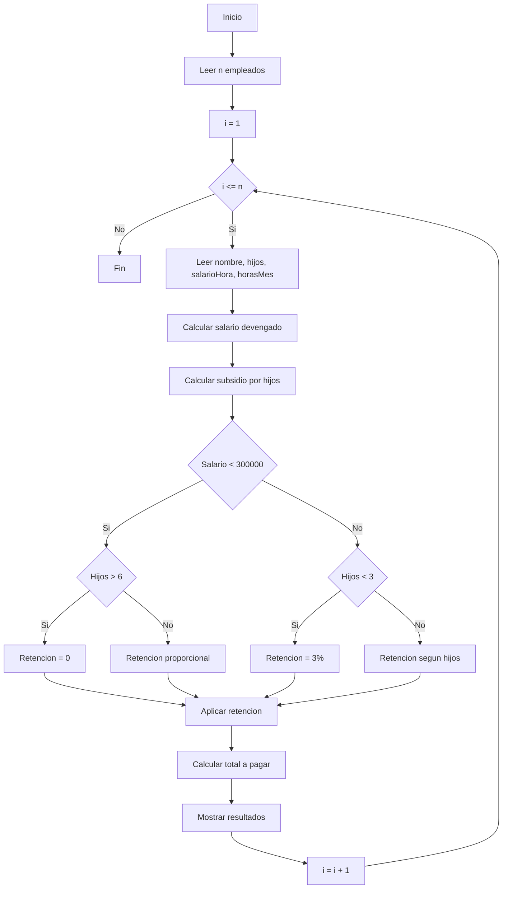

Punto 6
# Optimización de Nómina de Empleados

## Objetivo
Para una empresa con un número variable de empleados, calcular por cada empleado:
- Salario devengado
- Retención (según salario y número de hijos)
- Subsidio por hijos
- Total a pagar

### Reglas
- Subsidio por hijo: **$1.200**

**Retención:**
1) Si el salario devengado es **menor a $300.000**:
   - Si hijos > 6 → **no hay retención (0%)**
   - Si hijos <= 6 → porcentaje = **(6 − hijos) / 2**  (%)

2) Si el salario devengado es **mayor o igual a $300.000**:
   - Si hijos < 3 → **3%**
   - Si hijos >= 3 → porcentaje = **10 / hijos**  (%)

---

## 1) Definición de variables

### Entrada (por empleado)
- `nombre` : cadena
- `hijos` : entero (>= 0)
- `salarioHora` : real (>= 0)
- `horasMes` : real (>= 0)

### Proceso
- `devengado` : real
- `porcentajeRet` : real (en decimal, ej. 0.03)
- `retencion` : real
- `subsidio` : real
- `totalPagar` : real

### Control
- `n` : entero (cantidad de empleados)
- `i` : entero (contador)

### Salida (por empleado)
- `nombre`, `devengado`, `porcentajeRet`, `retencion`, `subsidio`, `totalPagar`

---

## 2) Pseudocódigo

```text
Algoritmo NominaEmpleados
    Leer n

    Para i <- 1 Hasta n Hacer
        Leer nombre
        Leer hijos
        Leer salarioHora
        Leer horasMes

        devengado <- salarioHora * horasMes
        subsidio <- hijos * 1200

        Si devengado < 300000 Entonces
            Si hijos > 6 Entonces
                porcentajeRet <- 0
            SiNo
                porcentajeRet <- ((6 - hijos) / 2) / 100
            FinSi
        SiNo
            Si hijos < 3 Entonces
                porcentajeRet <- 0.03
            SiNo
                porcentajeRet <- (10 / hijos) / 100
            FinSi
        FinSi

        retencion <- devengado * porcentajeRet
        totalPagar <- devengado - retencion + subsidio

        Escribir "Empleado: ", nombre
        Escribir "Devengado: $", devengado
        Escribir "Retención (%): ", porcentajeRet * 100
        Escribir "Retención ($): $", retencion
        Escribir "Subsidio: $", subsidio
        Escribir "Total a pagar: $", totalPagar
    FinPara
FinAlgoritmo
```
## Diagrama de flujo



## Prueba de escritorio

### Caso de prueba
Empleado: Ana  
Hijos: 2  
Salario hora: 12.500  
Horas mes: 20  

| Paso | Cálculo | Resultado |
|-----:|---------|-----------|
| Devengado | 12.500 × 20 | 250.000 |
| % Retención | (6−2)/2 | 2% |
| Retención | 250.000 × 0.02 | 5.000 |
| Subsidio | 2 × 1.200 | 2.400 |
| Total | 250.000 − 5.000 + 2.400 | **247.400** |


